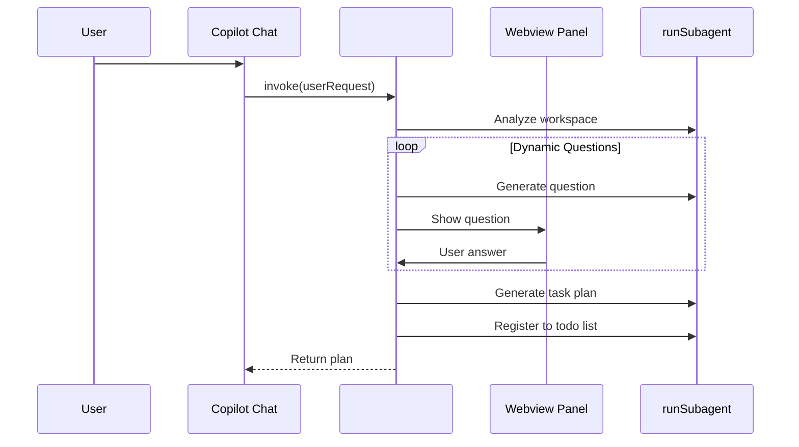

# Task Planner

A VS Code extension that asks clarifying questions before complex tasks using `runSubagent`.

## Features

- **Workspace Analysis**: Analyzes project context before asking questions
- **Dynamic Q&A**: Generates clarifying questions one at a time based on previous answers
- **4-Choice + Other**: Each question has 4 options plus a free-text "Other" option
- **Back Navigation**: Go back to redo previous questions
- **Task Plan Generation**: Creates detailed, structured task plans
- **Todo Integration**: Registers tasks to `manage_todo_list` for tracking

## How It Works



## Usage

1. Press `F5` to launch the extension
2. Open Copilot Chat
3. Type `#plan` followed by your request:
   ```
   #plan テストコードを追加して欲しい
   ```
4. Answer the questions in the interactive Webview
5. Get a detailed task plan

## Development

```bash
npm install
npm run compile
```

## File Structure

```
src/
└── extension.ts    # TaskPlannerTool implementation with Webview
```

## License

MIT
