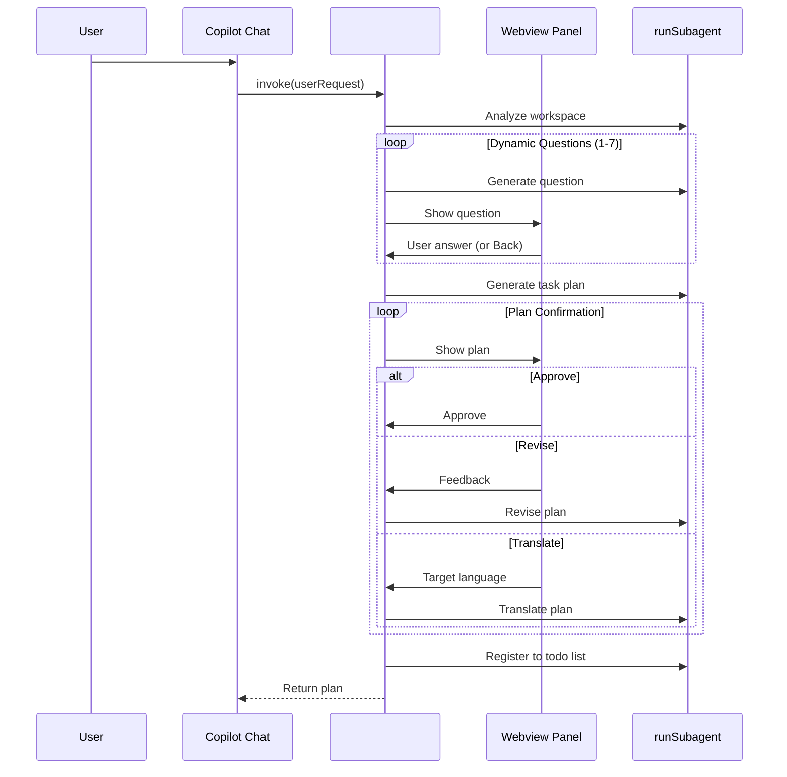

# Task Planner

A VS Code extension that generates high-quality, agent-executable task plans through interactive Q&A using Copilot's `runSubagent` capability.

## Features

- **Workspace Analysis**: Analyzes project context before asking questions
- **Dynamic Q&A**: Generates 1-7 clarifying questions based on intent discovery priorities
- **4-Choice + Other**: Each question has 4 options plus a free-text "Other" option
- **Back Navigation**: Go back to redo previous questions
- **Agent-Executable Plans**: Creates detailed task plans optimized for autonomous AI agent execution
- **Thinking Guidance**: Each step includes reasoning guidance for better agent decision-making
- **Autonomous Execution Support**: Plans include self-recovery protocols and forward momentum guidelines
- **Plan Confirmation**: Review, approve, or revise the generated plan before execution
- **Multi-language Translation**: Translate plans to 14+ languages (Japanese, Chinese, Korean, etc.)
- **Plan Revision**: Provide feedback to refine the plan iteratively
- **Todo Integration**: Registers tasks to `manage_todo_list` for tracking

## How It Works



## Usage

1. Press `F5` to launch the extension
2. Open Copilot Chat
3. Type `#marathonPlanner` followed by your request:
   ```
   #marathonPlanner add unit tests for the authentication module
   ```
4. Answer the clarifying questions in the interactive Webview
5. Review the generated plan:
   - **Approve**: Accept the plan as-is
   - **Revise**: Provide feedback to modify the plan
   - **Translate**: Switch language using the dropdown (🌐)
6. Tasks are automatically registered to the todo list

## Generated Plan Format

The generated plans are optimized for autonomous AI agent execution:

```markdown
# Task: [Concise, specific task name]

## Context for Agent
[Brief context including project type, key technologies, relevant patterns]

## Success Criteria
- [ ] [Verifiable criterion 1]
- [ ] [Verifiable criterion 2]

## Design Principles

### Approach Rationale
[WHY this approach was chosen over alternatives]

### Codebase Patterns to Follow
- [Pattern 1 with file reference]
- [Pattern 2 with file reference]

### Anti-patterns to Avoid
- ❌ [What NOT to do and why]

## Steps

### Step 1: [Action verb + specific target]
**Goal**: [What this step accomplishes]

**Thinking Guide**:
> Before starting, consider: [Key questions for the agent]
> Decision criteria: [How to handle ambiguous situations]

**Files**:
- `path/to/file.ts` - [what to do]

**Actions**:
1. [Specific action]

**Watch Out For**:
- ⚠️ [Potential pitfall]

**Verify**: [Verification command]

**If Blocked**: [Fallback approach]

➡️ **Next**: Immediately proceed to Step 2.

---

[Additional steps...]

## Final Verification
[Build, test, lint commands and functional checks]

## Error Recovery
[Specific guidance for common failures]

## Agent Decision Guidelines
[Principles for handling uncertainty]

## Autonomous Execution Guidelines
[Forward momentum, self-recovery, completion signals]
```

## Architecture

This extension uses a **Manager-Worker pattern**:

- **Manager**: The extension orchestrates the workflow
- **Workers**: Subagents invoked via `runSubagent` handle specific tasks

### 5-Phase Workflow

1. **Workspace Analysis** - Understand project context
2. **Interactive Q&A** - Gather requirements through questions
3. **Plan Generation** - Create agent-executable task plan
4. **Plan Confirmation** - User reviews and approves/revises
5. **Task Registration** - Register steps to todo list

## Development

```bash
npm install
npm run compile
```

## File Structure

```
src/
├── extension.ts                    # Main entry point, TaskPlannerTool
├── constants/
│   ├── runtime.ts                  # Runtime configuration
│   ├── ui.ts                       # UI constants
│   └── languages.ts                # Supported languages
├── orchestrators/
│   ├── question-flow.ts            # Q&A phase orchestration
│   └── plan-confirmation.ts        # Plan review orchestration
├── services/
│   ├── workspace-analysis.service.ts
│   ├── question-generator.service.ts
│   └── plan/
│       ├── plan-generator.service.ts
│       ├── plan-reviser.service.ts
│       ├── plan-translator.service.ts
│       └── task-registration.service.ts
├── prompts/
│   └── templates/
│       ├── workspace-analysis.ts   # Workspace analysis prompt
│       ├── question-generation.ts  # Question generation prompt
│       ├── plan-generation.ts      # Plan generation prompt
│       ├── plan-operations.ts      # Revision/translation prompts
│       └── task-registration.ts    # Task extraction prompt
├── ui/
│   ├── html-generator.ts           # Webview HTML generation
│   ├── webview-script.ts           # Client-side script
│   ├── styles/                     # CSS styles
│   └── webview/                    # Webview handlers
├── types/
│   ├── messages.ts                 # Message type definitions
│   └── guards.ts                   # Type guards
└── utils/
    ├── subagent.ts                 # runSubagent wrapper with retry
    ├── temp-file-manager.ts        # Temp file handling
    ├── json/                       # JSON parsing utilities
    └── webview/                    # Webview utilities
```

## Key Features for Agent Execution Quality

### Thinking Guidance
Each step includes a "Thinking Guide" that helps the executing agent reason about:
- What questions to consider before coding
- How to make judgment calls when facing ambiguity
- What existing patterns to reference

### Autonomous Execution Guidelines
Plans include explicit instructions to:
- Maintain forward momentum (don't stop between steps)
- Self-recover from obstacles (try alternatives before blocking)
- Progress checkpoints (verify periodically without waiting)
- Completion signals (when to consider the task done)

### Anti-patterns
Plans explicitly list what the agent should NOT do, both for:
- Implementation (e.g., "Don't use sync file operations")
- Execution behavior (e.g., "Don't stop to ask for confirmation")

## License

MIT
