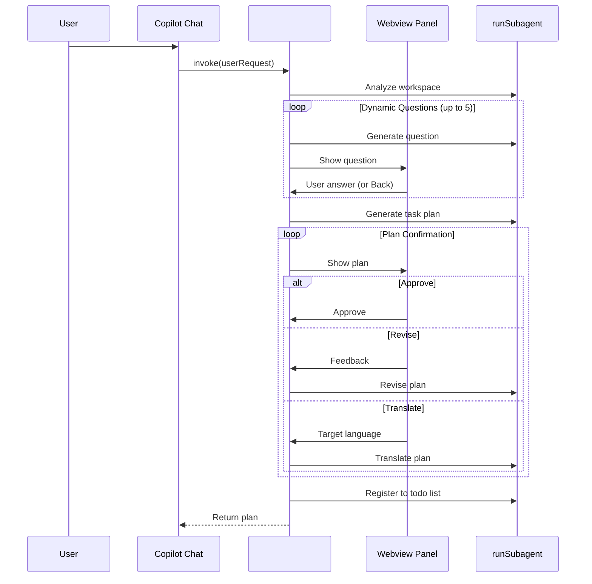

# Task Planner

A VS Code extension that asks clarifying questions before complex tasks using `runSubagent`.

## Features

- **Workspace Analysis**: Analyzes project context before asking questions
- **Dynamic Q&A**: Generates clarifying questions one at a time based on previous answers
- **4-Choice + Other**: Each question has 4 options plus a free-text "Other" option
- **Back Navigation**: Go back to redo previous questions
- **Task Plan Generation**: Creates detailed, structured task plans in English
- **Plan Confirmation**: Review, approve, or revise the generated plan before execution
- **Multi-language Translation**: Translate plans to 14+ languages (Japanese, Chinese, Korean, etc.)
- **Plan Revision**: Provide feedback to refine the plan iteratively
- **Todo Integration**: Registers tasks to `manage_todo_list` for tracking

## How It Works



## Usage

1. Press `F5` to launch the extension
2. Open Copilot Chat
3. Type `#plan` followed by your request:
   ```
   #plan add unit tests for the authentication module
   ```
4. Answer the clarifying questions in the interactive Webview
5. Review the generated plan:
   - **Approve**: Accept the plan as-is
   - **Revise**: Provide feedback to modify the plan
   - **Translate**: Switch language using the dropdown (🌐)
6. Tasks are automatically registered to the todo list

## Generated Plan Format

```markdown
# Task: [Concise task name]

## Overview
[What will be implemented and why]

## Goals
- [Specific, measurable goals]

## Scope
- [Files/directories to modify]
- [What is OUT of scope]

## Approach
- [Key technical decisions]

## Completion Criteria
- [How to verify completion]

## Steps
1. [Atomic, actionable step (~5-15 min each)]
2. [Next step...]
```

## Development

```bash
npm install
npm run compile
```

## File Structure

```
src/
└── extension.ts    # TaskPlannerTool implementation with Webview
```

## License

MIT
