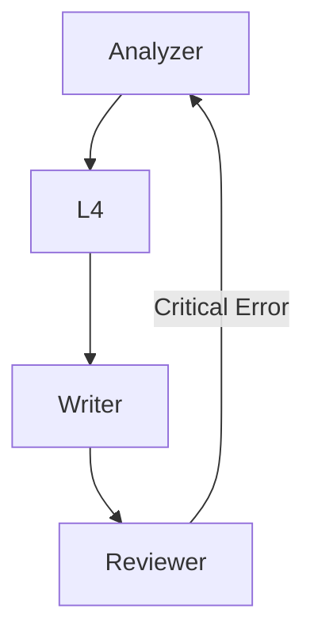

# Mastering `runSubagent`: Patterns for Programmatic Agent Orchestration in VS Code

The `runSubagent` tool is a powerful capability within VS Code's Copilot Chat API that allows extensions to spawn autonomous, stateless AI agents to perform complex tasks. Unlike standard chat interactions, `runSubagent` enables a **"Manager-Worker" architecture**, where a main extension tool orchestrates multiple specialized agents to achieve a larger goal.

This guide distills the know-how gained from building the **DeepWiki Generator**, a sophisticated documentation engine that orchestrates a 9-stage agentic pipeline (L1-L9) with validation gates and self-correction loops.

## 1. The Basics: Invoking a Sub-Agent

To invoke a sub-agent programmatically, you use `vscode.lm.invokeTool`. The sub-agent runs in its own isolated context and returns a result string.

```typescript
import * as vscode from 'vscode';

const result = await vscode.lm.invokeTool(
    'runSubagent',
    {
        input: {
            description: "Analyze the project structure", // Short description for UI
            prompt: "You are a Surveyor Agent. Scan the current workspace and..." // Detailed System Prompt
        },
        toolInvocationToken: options.toolInvocationToken // Pass the token from the parent request
    },
    token // CancellationToken
);

// Parse the result
for (const part of result.content) {
    if (part instanceof vscode.LanguageModelTextPart) {
        console.log("Agent Output:", part.value);
    }
}
```

### Key Concepts
- **Stateless**: Each `runSubagent` call starts fresh. It has no memory of previous turns unless you pass context in the `prompt`.
- **Synchronous**: The call awaits the agent's completion.
- **Token Propagation**: You MUST pass the `toolInvocationToken` to allow the sub-agent to access the workspace and other tools on behalf of the user.

---

## 2. Architecture: Manager-Worker Pattern

Do not try to do everything in one prompt. Instead, use the **Manager-Worker** pattern.

- **Manager (`DeepWikiTool`)**: A standard TypeScript tool. It contains logic, state management, and orchestration flow (loops, conditionals). It does NOT use LLMs directly for thinking; it delegates thinking to Workers.
- **Workers (Sub-Agents)**: Specialized prompts passed to `runSubagent`. They are transient and task-specific (e.g., "Surveyor", "Writer", "Reviewer").

### Data Sharing via File System
**CRITICAL**: Do NOT rely on the sub-agent's chat response (`result.content`) to pass data back to the Manager.
- **Token Limits**: Large outputs will be truncated or cause errors.
- **Stability**: Parsing complex data from chat text is fragile.

**Best Practice**: Use the **File System** as shared memory.
Instruct the agent to write its result to a specific file, and then have the Manager read that file.

**Flow:**
1.  **Manager**: "Analyze file X and write the report to `.deepwiki/intermediate/report_X.md`."
2.  **Worker 1**: Reads file X, thinks, writes `report_X.md`.
3.  **Manager**: Reads `report_X.md` (or instructs Worker 2 to read it).

### Why File Output? (Bypassing Context Limits)
Using the tool's return value (`result.content`) restricts you to the agent's **final message**, which is strictly limited by the model's context window size.

By instructing the agent to use `write_file`, you unlock:
- **Unlimited Output Size**: Agents can generate content far larger than the chat context limit.
- **Multiple Outputs**: An agent can call `write_file` multiple times to create many distinct files in a single session (e.g., generating 10 documentation pages at once).
- **Incremental Progress**: Large artifacts can be built up step-by-step without hitting token limits.

### Chat Output Constraint
To ensure stability and save tokens, explicitly instruct the sub-agent to keep its chat response minimal.

```typescript
const minimalConstraint = `
CONSTRAINT:
- Do NOT output the full content in your chat response.
- ONLY write to the specified files.
- Your final response should be a brief confirmation like "Task completed."
`;
```

---

## 3. Advanced Patterns

### A. Sequential Processing with Auto-Retry
Run sub-agents sequentially to ensure context propagation (e.g., one agent can fix shared context files for subsequent agents). Failed tasks are automatically retried.

```typescript
// Helper function for sequential execution with retry
async function runTasksSequentially<T>(
    tasks: (() => Promise<T>)[],
    taskGroupName: string,
    token?: vscode.CancellationToken
): Promise<T[]> {
    const results: T[] = [];
    const failedIndices: number[] = [];

    // First pass
    for (let i = 0; i < tasks.length; i++) {
        if (token?.isCancellationRequested) throw new vscode.CancellationError();
        try {
            results[i] = await tasks[i]();
        } catch (error) {
            if (error instanceof vscode.CancellationError) throw error;
            failedIndices.push(i);
        }
    }

    // Retry failed tasks once
    for (const idx of failedIndices) {
        if (token?.isCancellationRequested) throw new vscode.CancellationError();
        try {
            results[idx] = await tasks[idx]();
        } catch { /* logged */ }
    }

    return results;
}

// Usage
const tasks = components.map((component) => {
    return () => vscode.lm.invokeTool('runSubagent', {
        input: {
            description: `Analyze ${component.name}`,
            prompt: `Analyze this component: ${JSON.stringify(component)}...`
        }
    }, token);
});

await runTasksSequentially(tasks, 'Analysis', token);
```

**Features:**
- **Context Propagation**: Each agent can fix shared context files (e.g., `project_context.md`) for subsequent agents
- **Auto-Retry**: Failed tasks are automatically retried once after all initial tasks complete

### B. Self-Correction Loop (Draft -> Review -> Refine)
LLMs make mistakes. Implement a feedback loop within the Manager.

```typescript
let retryCount = 0;
while (retryCount < MAX_RETRIES) {
    // 1. Draft
    await runPhase('Drafter', ...);
    
    // 2. Review
    await runPhase('Reviewer', 'Check the draft for errors...', ...);
    
    // 3. Check Review Result (read report file)
    const report = await readJson('review_report.json');
    if (report.status === 'OK') break;
    
    // 4. Refine (Retry)
    await runPhase('Refiner', 'Fix the draft based on review...', ...);
    retryCount++;
}
```

### C. Critical Failure Loop
If a downstream agent (e.g., L6 Reviewer) finds a fundamental flaw that requires re-doing upstream work (e.g., L3 Analysis), the Manager can loop back the pipeline.



---

## 4. Prompt Engineering Tips for Sub-Agents

### 1. Tool Constraints (Security & Safety)
Sub-agents might hallucinate or try to use dangerous tools (like `run_in_terminal`). Explicitly whitelist allowed tools in the prompt.

```typescript
const commonConstraints = `
CONSTRAINTS:
- **ALLOWED TOOLS**: 
- **FORBIDDEN**: Do NOT use 
- **OUTPUT**: Do NOT output file content to chat. Only write to files.
`;
```

### 2. Structured Output
Force agents to output data in specific formats (JSON, YAML, Markdown with Frontmatter) to make it machine-readable for the next step.

```text
Output:
- Write to "component_list.json".
- Format: [{"name": "Auth", "files": [...]}]
- IMPORTANT: Write RAW JSON, no markdown code blocks.
```

### 3. Causal Reasoning
To get high-quality analysis, explicitly ask for "Chain of Thought" and "Causal Reasoning".

```text
Don't just describe *what* the code does. Explain *why* it does it.
Trace the causal flow: "Because event X happens, function Y is triggered, resulting in state Z."
```

---

## 5. Pitfalls & Troubleshooting

### Template Literal Escaping in TypeScript
When embedding Markdown templates (which use backticks `) inside TypeScript template literals (which also use backticks), escaping gets messy.

**Bad:**
```typescript
const prompt = `Use this template: 
```json ... ``` `;
```

**Good:**
```typescript
const bq = '`';
const mdBlock = bq + bq + bq;
const prompt = `Use this template: ${mdBlock}json ... ${mdBlock}`;
```


---

## Summary

By combining **TypeScript's control flow** with **`runSubagent`'s autonomous capabilities**, you can build powerful, self-correcting, and safe agentic workflows within VS Code. The key is to treat sub-agents as "File I/O Workers" and keep the orchestration logic strictly in your code.

```
